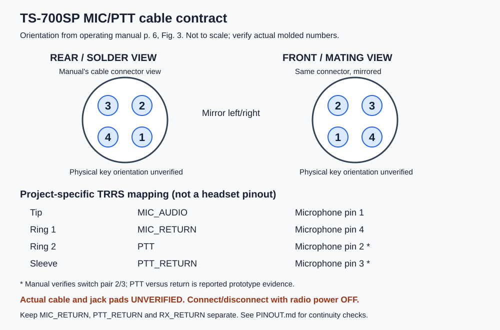

# TS-700SP connector and cable contract

Status: documentary pin mapping verified; adapter continuity and connector pad mapping unresolved. Partial implementation of [issue #10](https://github.com/zarthur/ts-700-usb/issues/10). No hardware measurements were made.

## Sources and orientation

The [local Kenwood operating manual](docs/references/ts700sp-operating-manual.pdf), PDF/printed page 6, Figure 3, was visually inspected during this implementation. It explicitly shows the **rear of the microphone connector**: in the printed drawing, upper-left is 3, upper-right 2, lower-left 4, lower-right 1. The microphone is connected between 1 (signal) and 4 (shield); its separate PTT switch connects 2 and 3. The assignment **2 = PTT, 3 = PTT_RETURN** is reported prototype evidence in [the research report](docs/research-solutions.md), not an independently measured distinction established by the switch symbol alone.

The front/mating view of that same cable connector is a left/right mirror in the same page orientation: upper-left 2, upper-right 3, lower-left 1, lower-right 4. Do not apply either view to a different connector half without verifying its molded numbering and key. The drawing is an orientation aid, not a dimensioned footprint or an exact part selection. Physical key/notch orientation is unverified; no key geometry is established by this diagram. Confirm the actual connector key and molded numbering before assembly.

## Settled MIC/PTT adapter contract

TRRS contacts are named along the plug from its end toward the cable: tip, ring 1, ring 2, sleeve. This is a project-specific cable, not a headset pinout. Label the interface jack **RADIO MIC/PTT - TS-700SP ONLY**.

| TRRS contact | Net | Microphone connector pin | Evidence |
|---|---|---|---|
| Tip | MIC_AUDIO | 1 | Manual signal assignment; chosen TRRS contract |
| Ring 1 | MIC_RETURN | 4 | Manual shield assignment; chosen TRRS contract |
| Ring 2 | PTT | 2 | Manual switch pair; reported role assignment |
| Sleeve | PTT_RETURN | 3 | Manual switch pair; reported role assignment |

The exact TRRS jack MPN, its physical pad numbers, switched-contact behavior, and the actual cable are **unverified**. Contact names are not pad numbers. Before assigning a footprint, compare its manufacturer drawing and measure continuity from an inserted plug to every pad, including switched and shell contacts. Preserve MIC_RETURN, PTT_RETURN and RX_RETURN separately on the interface; do not add a common-ground link on the assumption that the radio joins them.

## Cable continuity worksheet

Power off the radio, disconnect the cable from both radio and interface, and test the cable alone. Record cable ID, connector photographs showing orientation, meter/range, lead resistance, date/operator and measured resistance for every matrix cell. `C` means intended conductor continuity; `O` means no conductive connection. Entries below are expectations, **not results**. Record actual ohms and meter over-range threshold; do not use an unqualified beep as the result. Investigate any unexpected continuity before use.

| TRRS contact → / mic pin ↓ | Tip | Ring 1 | Ring 2 | Sleeve |
|---|---|---|---|---|
| 1 | C | O | O | O |
| 2 | O | O | C | O |
| 3 | O | O | O | C |
| 4 | O | C | O | O |

Also test all six pairings between TRRS contacts for unexpected shorts and flex the cable gently while checking intended continuity. Record shell/shield connections separately: do not silently bond the cable shell to a return. Repeat the matrix after cable assembly and jack-pad verification. Actual allowable conductor resistance must be set from cable construction and the finalized electrical budget before acceptance.

## RX and computer-side audio interfaces

The operating manual page 6, section 2-7, identifies EXT SP as a 1/8-inch external-speaker connection and states insertion disconnects the internal speaker. This is a separate RX cable, not another contact on the MIC/PTT TRRS. The exact jack/plug contact assignment and actual-unit DC offset must be confirmed; the service reference and variant limitation are recorded in the research report.

| Interface | Intended signals | Unresolved verification |
|---|---|---|
| Radio EXT SP → isolated RX input | RX_AUDIO, RX_RETURN | Actual plug tip/sleeve continuity, radio variant, DC offset and levels |
| External sound-card output → isolated TX input | One selected output channel and computer-side return | Sound-card MPN, output contact mapping and level; never directly short stereo channels |
| Isolated RX output → sound-card input | Configurable selected tip/ring input and computer-side return | Input contact mapping, bias, clipping and required DC blocking |

Do not assume a CTIA/OMTP headset convention or join tip/ring until the actual sound card is identified. All computer-side audio returns stay on the computer side of the transformers.

## Operating and isolation checks

Connect radio cables fully **before radio power-on**. Switch radio power off before disconnecting or changing a cable. Live insertion is outside the accepted procedure; intermediate TRRS contact shorts are not covered by the static continuity matrix.

Before radio use, with all equipment unpowered and unplugged from the interface, attach the actual adapter cables and verify the complete interface has no unintended DC path between computer-side conductors/shields and radio-side conductors/shells. Include mounting hardware and enclosure contact. Record resistance/range and compare with limits established for the finalized design; do not infer isolation from a schematic or transformer presence alone. Account for capacitors settling during measurement. Use only an appropriate low-energy resistance check, not an unspecified high-voltage insulation test.

Final acceptance remains blocked by the actual cable matrix, exact jack pad verification, shell/enclosure mapping and sound-card/RX contact confirmation. Do not close #10 or freeze affected connector assignments until these records exist.
